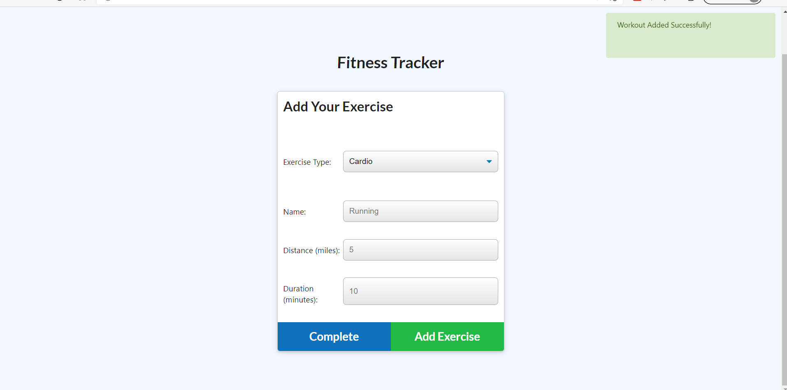
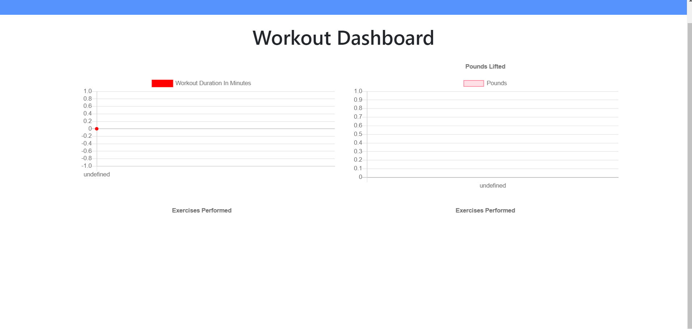

# fitness-tracker

Using HTML, JavaScript, and CSS, this is an app that allows the user to keep track of their workouts. They should be able to log the name of their workout, sets they have done, weights, duration, and reps they have done. If they decide to run, they should be able to track the distance they ran and how long it took.
The user can decide to keep track of different lifting exercises or carido workouts. Once they input the data of what they want to keep track of, the app will display the information in a chart to make it easy to read and see. 
This should be used by someone who is serious about keeping track of their workouts and is looking to live a healthy lifestyle. They can keep track of what kind of workouts they are doing and mentally keep track of their progress.
In the future I would like to come back and style it better and maybe add friends feature to keep track with lifting buddies.

## Contributors
Donald Gehring

# Contact

Feel free to contact me with any questions or visit my Github to see my other projects

dgehring7@gmail.com
github.com/dgehring7

## Screenshots

